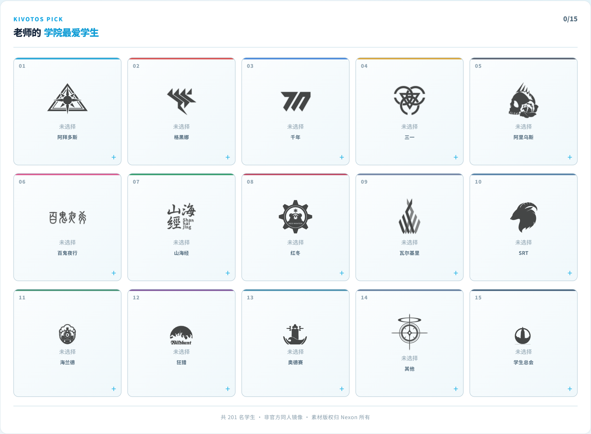
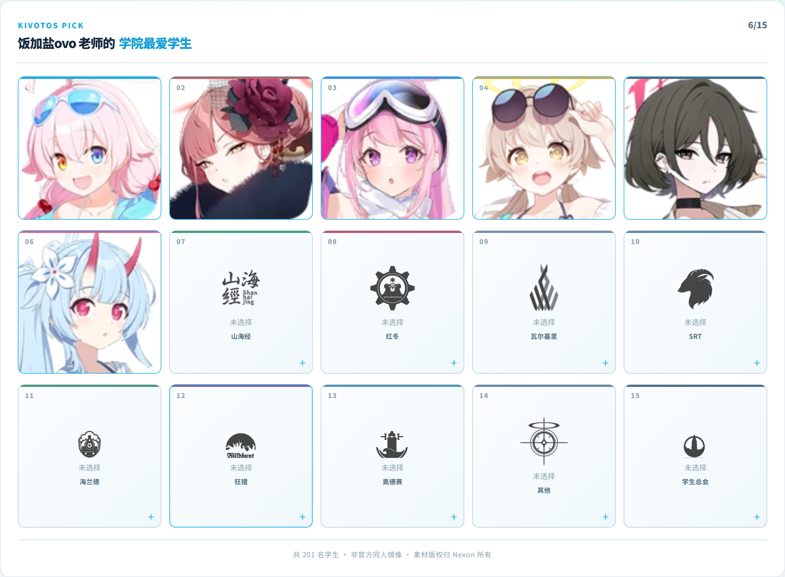
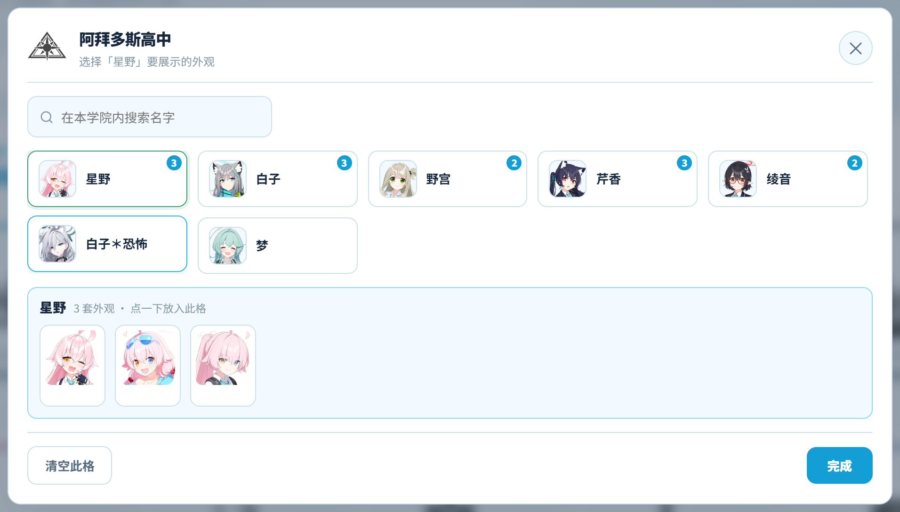
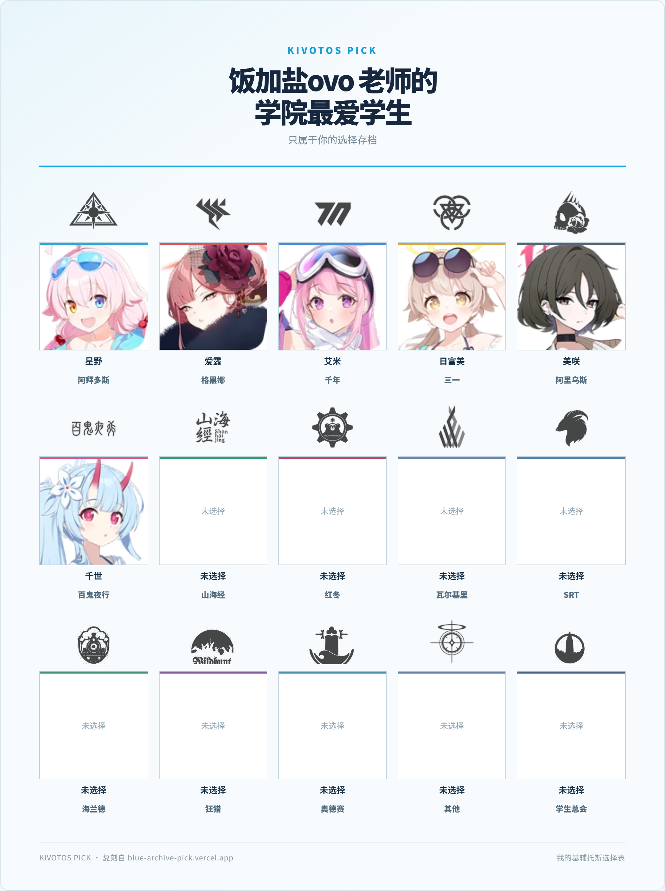

# 基辅托斯选择器（国内镜像复刻版）

[blue-archive-pick.vercel.app/favorite-students](https://blue-archive-pick.vercel.app/favorite-students) 的简体中文复刻：
从 15 个学院里各挑一名最喜欢的《蔚蓝档案》学生，填满选择板后一键保存成图片。

纯静态站点，无需后端、无需数据库、无需登录。

**在线地址：<https://r1ce1022.github.io/kivotos-pick-cn/>**
最爱学生页：<https://r1ce1022.github.io/kivotos-pick-cn/favorite-students/>

选择板（未选择 / 已选择）：





点角色后可在网格下方挑外观（卡片右上角的数字是可选外观数）：



导出的图片（版式照原站的「选择表」，手机与电脑出图完全一致）：



---

## 一、这个复刻做了什么

| 功能 | 实现情况 |
| --- | --- |
| 15 个学院槽位（每学院选 1 人） | ✅ |
| 点学院格 → 弹窗只列该学院学生 → 点选入格 | ✅ 唯一的主流程 |
| 弹窗内搜索（仅本学院、仅中文） | ✅ 打开弹窗时不自动聚焦 |
| **切换展示哪套外观**（换装/异格） | ✅ 点角色后网格下方出现外观条，点一下即入格 |
| 已选学生自动从原学院移出（一人只占一格） | ✅ 换外观仍算同一角色 |
| 老师名字输入 + 已选进度（0/15） | ✅ |
| 已选记录本地保存（刷新/重开浏览器后自动恢复） | ✅ 只存 id 引用，数据重新生成后仍可用；**所选外观一并保留** |
| 一键重置（同时清空本地记录） | ✅ |
| 导出 PNG（含标题、进度、学生头像） | ✅ 2 倍像素密度，**手机与电脑出图完全一致** |
| 响应式（桌面 / 平板 / 手机） | ✅ 320px 起无横向溢出 |
| 首页（原站有 `/top-nine`、`/bingo`） | ⚠️ 本期只做 `/favorite-students` |

原站是韩文界面，本复刻为**简体中文**，学生名使用 SchaleDB 官方简中译名。
整站配色与导出模板对齐原站（浅色青蓝），但界面文案为中文、版式按中文阅读习惯微调，
不追求逐像素还原。

> **设计取舍：删掉了全局学生名单。**
> 早期版本沿用了原站的「学生总列表 + 学院标签 + 跨学院搜索」，但它与真实使用方式不符：
> 用户只需为某个学院挑人，看到其他学院的学生没有意义。
> 更关键的是它在移动端制造了往返——要滚过 2000px 的名单选人，再滚回顶部放格
> （当时靠一个固定底栏来缓解）。改为「点学院格选人」后，往返、待选机制、固定底栏、
> 桌面拖拽、学院标签条一并移除，页面只剩一个入口。
> 搜索保留但收敛为**弹窗内、仅本学院、仅中文**；多语言别名索引（`aliases`）随之删除，
> `data/students.json` 因此缩小约 23%。

### 导出模板

导出版式照原站的「选择表」做法，而不是屏幕版选择板的截图：

```
标题区    KIVOTOS PICK → 「X 老师的 / 学院最爱学生」 → 副标题 → 青色下边框
网格      5 列 × 3 行，每格 = 校徽 → 头像(1:1) → 学生名 → 学院名
          头像顶部有一条该学院的强调色横条
页脚      左「KIVOTOS PICK · 复刻自 blue-archive-pick.vercel.app」
          / 右「我的基辅托斯选择表」
```

画幅 1000px 宽（导出 2 倍 = 2000px），配色取自原站：
底色 `#f7fbfd`、主色 `#1ba9e4`、正文 `#17283e`、次要 `#536c7e`。

15 个学院的强调色从原站提取，定义在 `scripts/academies.mjs` 的 `accent` 字段。

> **校徽素材是「白色图形 + 透明底」，浅色主题下必须压深。**
> 15 个校徽来自两个来源，颜色并不一致：11 个取自 SchaleDB 的
> `School_Icon_*_W.png`（纯白 `255,255,255`），4 个较新学院取自镜像源（中灰 `78~110`）。
> 白的那种若不加处理，在浅底上等于隐形——实测叠加后亮度 253（白底约 250），
> 表现就是「槽位空着」。现在选择板、导出模板、弹窗标题三处统一使用
> `filter: brightness(0) saturate(100%)`，实测亮度降到 70。
> `verify-ui` / `verify-mobile` / `verify-live` 三个脚本都内置断言：
> 任一校徽亮度 > 200 即失败。

### 导出一致性（重要设计约定）

**同一份选择，无论在手机还是电脑上点「保存图片」，生成的 PNG 逐像素完全相同**（实测差异 0 像素）。

实现方式：`CaptureBoard` 组件渲染两份——

- 屏幕上一份跟随设备断点（手机上选择板 2 列，观看更舒适）；
- 离屏一份（`.exportStage`，固定 1000px 宽）专供截图，尺寸被 CSS 锁死。

截图目标是离屏那份，因此出图不随设备变化。需要注意的坑：

1. 响应式断点依据**视口**宽度而非元素宽度，所以断点规则不能命中导出节点。
   导出用的是 `.exportGrid` / `.slotExport` 等独立类名，不会匹配 `.board` 的断点；
   唯一在两个版本间共用类名的是 `.captureArea`，故只有它需要写成
   `:not(.captureExport)`，后代元素则由 CSS 里的「导出几何锁定」块
   用 `.exportStage .xxx` 提高权重覆盖。
2. 不要用 `vw` 单位——它跟的是视口，手机上会算出更小字号并改变行高；
   导出节点内必须用固定值。
3. `1fr` 的解析依赖可用宽度，而桌面有滚动条、手机没有，会差一个滚动条宽度；
   导出节点用 `scrollbar-gutter: stable` 恒定预留，出图因此确定。

### 已选记录的本地保存

选择结果与老师名字存在 `localStorage`，刷新或重开浏览器后自动恢复（代码在 `lib/roster-storage.ts`）。

三个关键决定：

1. **只存 id 引用，不存角色对象**。角色数据是构建期内联的，一旦重新生成
   （改名、增删角色）旧记录就会失效；存 `{学院 id, 角色 id, 外观 id}` 则可以在读取时
   按当前数据重新解析。实测存储内容里不含立绘路径等冗余字段。
2. **恢复必须放在 `useEffect` 里**，不能用于 `useState` 初值。首帧若直接渲染存储内容，
   SSR 的空白选择板与客户端的已选状态不一致，会触发水合报错。
3. **存储键带版本号**（`kivotos-pick-cn:roster:v1`）。结构不兼容时换 key，
   旧数据自然失效，因此不需要写迁移逻辑。

> **外观功能上线时没有升版本号**，而是让读取兼容旧格式：旧记录只有 `studentId`，
> 其值恰好等于基础外观的 id，因此回退按它解析，老用户的选择不会凭空消失。
> 若因为字段改名就升 key，反而是把所有人的记录清空。

读取全程防御式解析：版本不符、JSON 损坏、学院或角色已不存在、外观与角色对不上、
同一角色重复占格等情况都会被丢弃并降级为空选择板，**不会让页面崩掉**。
写入失败（配额满、隐私模式、`localStorage` 被策略禁用）静默忽略——存不下不该影响正常使用。

「重置」会连带清空本地记录，且重置后不再回写，因此刷新不会把旧记录带回来。

### 水合一致性（踩过的坑）

**渲染期不要做时区相关的日期格式化。** 页脚原本写的是
`new Date(generatedAt).toLocaleDateString('zh-CN')`，而构建机是 UTC、
中国用户是 UTC+8，于是同一条数据在两端算出**差一天**的日期：

```
SSR（构建机 UTC）   → 2026/9/28
浏览器（UTC+8）      → 2026/9/29   ← 文本不一致，React 报 #418
```

React 遇到内容不匹配会放弃 SSR 结果、退回纯客户端渲染，用户侧表现为首屏闪一下。
现在改为在 `npm run build:data` 阶段把日期固化成字符串存进 `generatedDate`，
渲染期只做字符串拼接，两端必然一致。

`npm run verify:hydrate` 用 `Asia/Shanghai` 时区打开页面，
比对 SSR HTML 与客户端首帧的页脚文本并检查控制台无错误，防止这个问题复发。

---

## 二、技术栈与结构

- **Next.js 16**（App Router + Turbopack）+ **React 19** + **TypeScript**
- **CSS Modules**，无 UI 框架依赖
- `html-to-image` 负责导出图片
- `next.config.ts` 里 `output: 'export'`，构建产物是纯静态的 `out/`

```
app/
  layout.tsx                          根布局
  page.tsx                            首页（三个模式入口）
  favorite-students/
    page.tsx                          主页面（全部交互逻辑）
    CaptureBoard.tsx                  选择板（live / export 双形态）
    favorite-students.module.css       页面样式（含导出几何锁定）
data/
  students.json                       学生数据（构建时打包进客户端 bundle）
types/students.ts                     类型定义
lib/students-data.ts                  数据加载
scripts/                              抓取与验证脚本（见下）
public/
  assets/students/*.webp              学生头像（333 张）
  assets/schools/*.png                学院校徽（15 个）
  favicon.svg / favicon.ico
```

**页面数据只随客户端 bundle 下发**：`data/students.json` 在构建时被打包进客户端代码，
HTML 里不含学生数据（服务端渲染时只剩 15 个空槽位）。与原站一致，运行时不发任何 `/api` 请求。

---

## 三、本地运行

```bash
npm install

# 首次需要先准备数据与素材（约 4 MB 下载）
npm run prepare:all

npm run build
npm run preview          # http://127.0.0.1:4173
```

开发模式：`npm run dev`

### 数据管线

`npm run prepare:all` 依次执行四步：

| 命令 | 作用 |
| --- | --- |
| `npm run fetch:data` | 下载 SchaleDB 简中学生数据到 `scripts/.cache/` |
| `npm run align` | 抓原站页面，用韩文数据反查，得出原站收录的学生 id 集合 |
| `npm run fetch:assets` | 下载学生头像 / NPC 头像 / 学院校徽到 `public/` |
| `npm run build:data` | 生成 `data/students.json` |

以上抓取脚本都通过 `scripts/net.mjs` 访问网络——它是共用的网络层（自动探测系统代理、
带重试与超时），不是独立脚本。

> `.cache/` 与 `.shots/` 已在 `.gitignore` 中，不会入库。

### 验证

```bash
npm run build
npm run preview &        # 另开一个终端
npm run verify           # 截图 + 交互测试 + 导出测试
```

`npm run verify` 会用本机 Chrome 跑一遍真实交互，并把截图写到 `scripts/.shots/`。
它验证：15 个校徽均可见、名字门禁、点学院格弹出的弹窗只列本学院角色、
**外观条的展开与切换（含单套外观角色应一步入格）**、弹窗打开时不自动聚焦搜索框、
中文搜索生效而韩文搜索无结果、导出节点用的是所选外观、导出图片。

另外四个针对部署、移动端与文档的验证：

```bash
npm run verify:mobile   # 320–1024px 无溢出、槽位 1:1、弹窗不裁切、触屏交互、移动端导出
npm run verify:parity   # 桌面与移动各导出一次并逐像素比对（必须 0 差异）
npm run verify:pages    # 子路径产物校验，用法：npm run verify:pages /kivotos-pick-cn 4180
npm run verify:live     # 线上验收：资源 + 渲染 + 交互 + 导出
npm run verify:storage  # 本地存储解析逻辑的单测（纯函数，无需启服务）
npm run verify:persist  # 本地存储的浏览器验收（选择保留、重置清空、损坏降级）
npm run verify:hydrate  # 水合一致性：SSR 与客户端首帧的文本必须完全相同
npm run verify:docs     # README 一致性（见下）
```

### 文档校验

`npm run verify:docs` 校验 `README.md` 与仓库实际状态是否一致，用来防住文档漂移：

| 检查 | 内容 |
| --- | --- |
| 配图引用 | `` 指向的本地图片是否存在 |
| 脚本引用 | 正文提到的 `scripts/*.mjs` 是否存在 |
| npm 命令 | 提到的 `npm run xxx` 是否已在 `package.json` 定义 |
| 覆盖度 | `scripts/` 下每个 `.mjs` 是否至少被文档提及 |
| 章节锚点 | `](#...)` 是否对应到实际标题 |
| 外链可达 | 文中 http(s) 链接是否返回 < 400 |

参数：`--offline` 跳过外链检查；`--strict-links` 让外链失败也计入失败（默认仅警告，
因为外链不可控，不应让本仓库的校验随机变红）。

> **配图是否过时无法自动判断**（需要跑浏览器渲染）。改动选择板外观后，
> 记得重新生成 `docs/*.png`，否则文档会「校验通过但图是旧的」。

### 其他脚本

| 脚本 | 用途 |
| --- | --- |
| `scripts/make-favicon.mjs` | 手写 PNG/ICO 编码生成 `favicon.ico`（无图像库依赖） |
| `scripts/serve-out.mjs` | 预览 `out/` 的极简静态服务器（根路径） |
| `scripts/serve-basepath.mjs` | 模拟子路径部署的预览服务器，如 `/kivotos-pick-cn/` |
| `scripts/verify-ui.mjs` | 桌面端验收（校徽可见性、点学院选人、名字门禁、导出） |
| `scripts/verify-basepath.mjs` | 校验子路径产物里所有引用是否可命中 |
| `scripts/verify-mobile.mjs` | 移动端适配验收 |
| `scripts/verify-export-parity.mjs` | 跨设备导出一致性（像素级） |
| `scripts/verify-live.mjs` | 线上验收（资源 + 渲染 + 交互 + 导出） |
| `scripts/verify-readme.mjs` | README 一致性校验 |
| `scripts/verify-storage.mjs` | 本地存储解析逻辑的单测（直接导入 `lib/roster-storage.ts`） |
| `scripts/verify-persistence.mjs` | 本地存储的浏览器验收 |
| `scripts/verify-hydration.mjs` | 水合一致性（用中国时区访问，比对 SSR 与客户端文本） |
| `scripts/resize-image.mjs` | 缩放/裁剪截图，便于查看超长页面 |

---

## 四、学生数据是怎么对齐的

原站选择列表共 **204 张卡片**。复刻的集合是完全对齐推导出来的：

| 组成 | 数量 | 中文名来源 | 头像来源 |
| --- | --- | --- | --- |
| 基础学生 | 144 | SchaleDB 简中，**官方译名** | SchaleDB CDN |
| `＊` 形态拆出的独立学生 | 1（白子＊恐怖） | SchaleDB 简中 | SchaleDB CDN |
| 剧情 NPC | 56 | **人工整理**（见下） | 镜像源 |
| 联动角色 | 4 | — | 镜像源，仅补素材、不进选择列表 |
| **合计** | **205** | | |

推导过程：

1. SchaleDB 简中全表 277 人；
2. 排除 **4 个联动角色**（御坂美琴、食蜂操祈、初音未来、佐天泪子）；
3. 剩下 144 个可获取角色，与原站名单的 id **完全一致**；
4. 原站另有 56 个剧情 NPC（`npc-arona`、`npc-rin`…），SchaleDB 的 students 表**不收录**这些人，头像也不在其 CDN 上，因此中文名写在 `scripts/academies.mjs` 的 `NPC_STUDENTS` 表里。

> 原先这一步还会「排除 129 个换装变体」。现在换装作为该角色的**可选外观**保留
> （见下节）；其中 `＊` 形态与重名形态另作处理，因此最终是 201 人而不是 200。

### 角色的可选外观（皮肤）

一名角色的换装（「星野（泳装）」「爱露（新年）」…）不再被丢弃，
而是作为该角色的**可选外观**：选人时点角色后，网格下方会出现外观条，点一下就放入该格。
外观只影响立绘，不改变角色身份、所属学院与「一人只占一格」的口径。

分组方式是**按 `PathName` 主干聚合**（`shiroko` / `shiroko_cycling` / `shiroko_terror`
→ `shiroko`）。不要改用 `FamilyName + PersonalName`：SchaleDB 这两个字段本身有瑕疵
（「紫（泳装）」的 `PersonalName` 被误写成「紫草」，正确是「紫」），
按它聚合会把一个角色拆成两个。

聚合之后再套两条人工规则（`scripts/build-students.mjs`）：

| 规则 | 处理 | 影响的角色 |
| --- | --- | --- |
| **同名形态只留一套** | 组内名字完全相同的形态按 `DefaultOrder` 只保留靠前的一个 | 星野的「武装」有两套立绘（10098/10099），观感重复，合并为一套 |
| **`＊` 形态算独立学生** | 形如「白子＊恐怖」的异格拆出来单独成一名学生 | 白子＊恐怖（`s10100`） |

> 这两条规则是**判断**而非数据事实，所以集中写在构建脚本里、并在 `stats` 中留痕
> （`duplicateFormsDropped` / `terrorSplit`），便于日后核对或推翻。

统计口径（在 `stats` 里）：

| 字段 | 含义 | 值 |
| --- | --- | --- |
| `total` | 角色数（页面显示的学生数） | 201 |
| `skinTotal` | 可选立绘总数 | 328 |
| `extraSkins` | 除基础外观以外的可选外观数 | 127 |
| `variantOnlyCharacters` | 只有变体形态、没有基础形态的角色数 | 1（雪玲，其首套外观即默认） |
| `duplicateFormsDropped` | 被合并掉的重名形态 | 1 |
| `terrorSplit` | 被拆成独立学生的 `＊` 形态 | 1 |

### 关于 NPC 中文名

这 56 人的名字没有官方数据源（SchaleDB 不收录），因此逐条比对过
[萌娘百科《蔚蓝档案/译名对照表》](https://mzh.moegirl.org.cn/蔚蓝档案/译名对照表)
及该站各角色的独立条目页，按**日文名**确认。

**两套译名体系，本站选「共识译名」**：该表同时给出「共识译名」（日服/国际服社区通用）
与「简中服译名」（国服官方），两者常不一致：

| 日服原文 | 共识译名 | 简中服官方 |
| --- | --- | --- |
| ゲヘナ学園 | 格黑娜学园 | 歌赫娜学院 |
| トリニティ総合学園 | 三一综合学园 | 崔尼蒂综合学院 |
| 由良木 モモカ | 由良木桃香 | 由良木桃可 |
| 七神 リン | 七神琳 | 七神凛 |

站内的学院名与 144 个可获取学生名都来自 SchaleDB（共识体系），
所以 NPC 一并对齐共识译名，避免一站之内混用两套体系。

**取「名」不取「全名」**：与可获取学生的短名风格一致（「星野」而非「小鸟游星野」）。
例如 `npc-karen` 用「可怜」而非「明乐可怜」，`npc-suou` 用「周防」而非「朝雾周防」。

仍有 **3 项无权威来源**，暂按社区通行叫法：

- `npc-false-president` → 「冒牌学生会长」、`npc-gsc-president` → 「学生会长」：属头衔而非人名
- `npc-rana` → 「拉娜」：萌娘译名表尚未收录该角色

如需修正，只改 `scripts/academies.mjs` 里的 `NPC_STUDENTS` 一处，
然后重新执行 `npm run build:data && npm run build` 即可。

### 搜索

只支持**中文名**，且只在你打开的那一个学院内检索（例如在阿拜多斯里搜「白」命中「白子」「白子＊恐怖」）。

匹配时会忽略全/半角括号与星号差异，所以「白子(恐怖)」也能匹配到「白子＊恐怖」。

不提供韩文/英文检索：早期版本为多语言别名建过索引（`aliases` 字段），
但中文用户不会用韩文搜，维护成本与数据体积都不值得，已移除。

---

## 五、部署

`npm run build` 产出的 `out/` 是纯静态文件，扔到任何静态托管即可（Nginx、对象存储、Vercel、GitHub Pages…）。

### 当前部署（GitHub Pages）

已通过 `.github/workflows/deploy.yml` 自动部署：推送到 `main` 即触发构建与发布。

```
https://r1ce1022.github.io/kivotos-pick-cn/
```

仓库的 **Settings → Pages → Source** 必须设为 **GitHub Actions**，否则工作流会在
`actions/configure-pages` 这一步失败。这是新仓库的默认关闭项，需要手动开启一次。

### 子路径部署的注意事项（踩过的坑）

Pages 项目页部署在 `/<仓库名>/` 子路径下，而 Next 只会给它自己生成的 `/_next/...`
自动加 `basePath`。以下三类路径必须自己处理，否则部署后 404：

| 位置 | 处理方式 |
| --- | --- |
| `students.json` 里的 `/assets/...` | `lib/students-data.ts` 按 `NEXT_PUBLIC_PAGES_BASE_PATH` 加前缀 |
| `public/` 下的 favicon | `app/layout.tsx` 手动加前缀 |
| 返回首页的原生 `<a href="/">` | 改用 `BASE_PATH` 拼接（`next/link` 会自动处理，原生标签不会） |

构建时通过两个环境变量控制（见工作流）：

- `PAGES_BASE_PATH` → 供 `next.config.ts` 设置 `basePath`（构建期路径重写）
- `NEXT_PUBLIC_PAGES_BASE_PATH` → 供运行时数据使用

> ⚠️ 必须带 `NEXT_PUBLIC_` 前缀。非该前缀的 `process.env.*` 不会被打包器内联进
> 客户端代码，会导致「服务端渲染的 HTML 路径正确、客户端水合后变回无前缀」的
> 不一致：首屏看起来正常，一旦发生状态更新（选人或搜索）图片就 404，
> 导出功能随之卡死。

本地预览不受影响：这两个变量不设置时路径保持根路径，`npm run preview` 照常工作。

### 通用注意点

- **素材已全部本地化**：头像与校徽都在 `public/` 下随产物发布，运行时不依赖 SchaleDB 或原站，国内访问无跨境依赖。`out/` 约 4.4 MB，共 382 个文件。
- **其它子路径托管**：若换到别的子路径，改工作流里的两个环境变量值即可，源码无需改动。

---

## 六、版权与来源声明

- 本页是**非官方同人作品**，与 Nexon /《蔚蓝档案》官方无关。
- 学生资料与头像取自 [SchaleDB](https://schaledb.com)，角色与美术资源版权归 **Nexon** 所有。
- 原本的韩文站点为 [blue-archive-pick.vercel.app](https://blue-archive-pick.vercel.app/favorite-students)。
  其中 12 个学院校徽来自 SchaleDB 官方仓库 `images/schoolicon/`；
  **海兰德 / 狂猎 / 奥德赛 / 学生总会** 这 4 个较新学院的校徽与全部 NPC 头像，SchaleDB 尚无对应资源，取自原站镜像，仅用于非商业的同人复刻。
- 本项目代码为独立实现，未复制原站代码。
- 建议仅作个人学习与交流使用。

**页面上的标注位置**（便于核对来源可见性）：

| 位置 | 内容 |
| --- | --- |
| 选择器页页脚 | 「本页是 blue-archive-pick.vercel.app 的简体中文复刻（非官方同人作品）…」并给出可点击链接 |
| 首页页脚 | 同上 |
| 导出图片页脚 | 左下角「KIVOTOS PICK · 复刻自 blue-archive-pick.vercel.app」 |
| 选择板内页脚 | 「非官方同人镜像 · 素材版权归 Nexon 所有」 |

---

## 七、已知限制

- 只实现了 `/favorite-students` 一个页面；原站的 `/top-nine` 与 `/bingo` 未做（首页已标注「待开发」）。
- 56 个剧情 NPC 的中文名为人工映射，非官方译名。
- 导出图片用 `html-to-image` 前端合成，超大画布在低端手机上可能较慢（本页 15 格规模实测约 1–2 秒）。
